# EventWORLD

Para aquellos pequeños aventureros que estan cansados de la monotomía y quieren conocer nuevas experiencias

# Introducción
Para aquellos pequeños aventureros que estan cansados de la monotomía y quieren conocer nuevas experiencias aparece WorldEvenT. Una aplicación que nos servirá tanto de guía para nuestros viajes como para para encontrar nuevas aficiones o simplemente despejarnos del estrés diario por nuestra zona.

Miembros del equipo: Alejandro Bonet Medina
Nombre del equipo: DIU3_BNET

Oportunidad
-----
Estamos en un mundo globalizado en el que la socialización y el turismo son factores importantes que hacen que en cualquier pequeño rincón del mundo se organicen eventos para todo tipo de personas. Normalmente conoces estos eventos a través de otras personas, por medios de comunicación o buscando detenidamente por la red, es por eso que nace esta aplicación que de manera sencilla y organizada nos permitirá conocer todo lo que pasa en cualquier lugar de Europa.

# Proceso de Diseño 

Analísis de nuestros usuarios
-----
Para realizar un buen diseño de la aplicación es necesario pensar en primer lugar que tipos de usuarios van hacer uso de esta.

La aplicación está dirigida a todos aquellos usaurios que busquen alguna de las siguientes necesidades:

El usuario quiere conocer nuevos lugares de su zona.
El usuario busca nuevos hobbies.
El usuario realizá viajes turisticos muy completos.
El usuario quiere disfrutar de sus tiempo libre.
El usuario quiere conocer a fondo la cultura de otros paises.
El usuario quiere realizar alguna actividad con otro/s usuario/s de su entorno.

Aplicaciones similares
---
Una aplicación bastante similar a la nuestra sería Fever. Esta aplicación nos muestra eventos tanto culturales como sociales o inclusos cursos online y presenciales. También incluye busqueda por filtros, la posibilidad de compartir con tus amigos, reservas o compras online. Sin embargo no te recomienda eventos según tu perfil y busqueda, esta caraterística si la incluimos en nuestra aplicación ya que nos parece bastante interesante y podría mejorar la experiencia del usuario.

Una aplicación también parecida es TripAdvisor solo que en esta en lugar de eventos trata de hoteles, vuelos, restaurantes; pero tiene una funcionalidad parecida en la que incluye valoraciones, opiniones y recomendaciones.

 Persona
-----

Hemos creado dos personas de características diferentes para obtener más puntos de vista y distintos  problemas para cada ususario.

Nuestra primera persona es Carlos. Carlos es un joven que acaba de llegar a su nueva ciudad después de haber aprobado sus oposiciones de funcionario, al ser una persona joven está acostumbrado a las tecnologías y lleva su móvil siempre encima. En cuanto a su personalidad destacar que es una persona activa que le gusta aprovechar su tiempo libre.

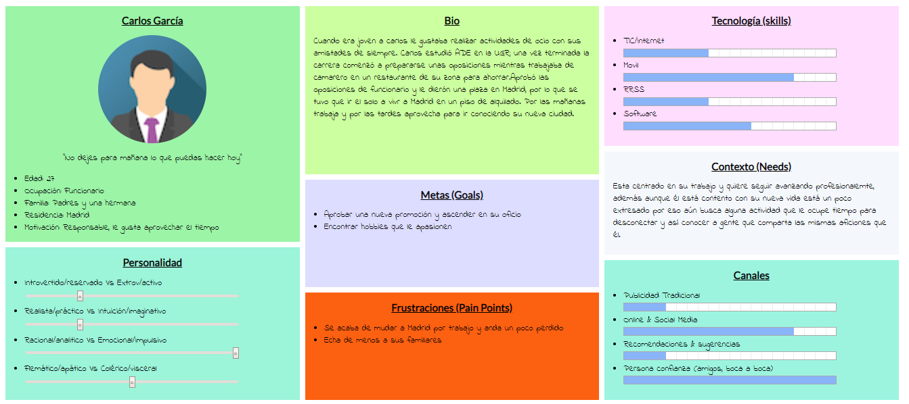

Nuestra segunda persona es María. María Angustias es una jubilada muy simpática muy cercana a su familia. Al ser de una edad avanzada le cuesta manejarse por las nuevas tecnologías porque para ella es algo totalmente nuevo y no esta acostumbrada.

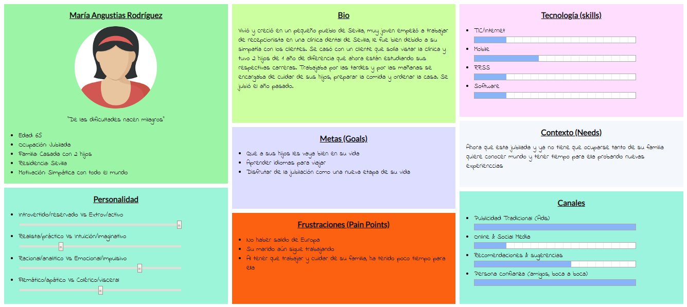

En el primer mapa de experiencia a Carlos no le importa que hacer así que no le cuesta mucho trabajo decidirse en la actividad a realizar, sin embargo si la web tuviese un foro de opiniones recomendaciones es posible que  Carlos hubiese escogido una actividad distinta. En cuanto al mapa de experiencia de María Angustias podemos ver como al ser una persona mayor su primera idea no es buscar por Internet. Además a la hora de navegar necesita ayuda

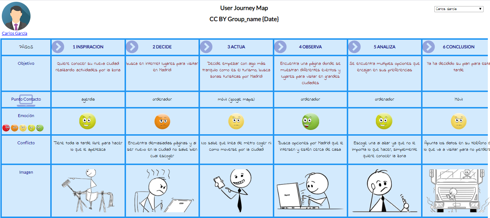
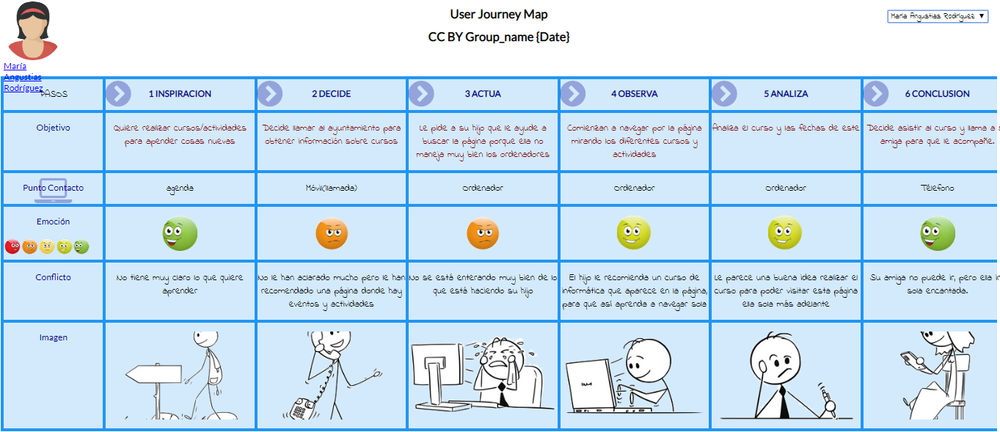

Usability Review
---

Una vez completados los primeros pasos del diseño relalizamos el primer Usability Review.Inicialmente se realizó para un portal web pero más tarde se rediseñó para una aplicación móvil como veremos más adelante. Trás completar el Usability Review se obtuvo una puntuación de 72 (GOOD). La página tiene una estructura muy sencilla, una pagina inicial con un listado de eventos de tu zona actual y un buscador por palabras claves y filtrado. El buscador es bastante intuitivo sin embargo para una persona novata quizás no logre a ver como funcionan los filtros o ni si quiera saber que están ahí. Al seleccionar un evento nos muestra información en un lenguaje conciso y sencillo y un contenido multimedia que complementa la información. Algunos eventos se tiene que reservar, nos aparece un boton bastante visible para reservar, sin embargo a la hora de reservar puede llegar a ser lioso para gente sin experiencia ya que son muchos pasos y datos los que tienes que poner. Al ser una pagina bastante sencilla su navegación es bastante fácil y la visión del contenido también quizás por eso no se tenga en cuenta añadir ayuda en linea. Es probable que la ayuda en linea le sea de bastante utilidad a personas sin experiencias que no sepan navegar.

  Feedback Capture Grid
----

Puntos positivos: Búsquedas fáciles de realizar.Interfaz intuitiva/fácil de manejar para una persona con un mínimo de experiencia. Contenido multimedia que mejora la interfaz de la pagina así como completar la información.

Puntos negativos: Un usuario no se puede registrar, esto impide poder valorar eventos, recibir sugerencias y cada vez que se realice una reserva tener que introducir nuevamente sus datos. No hay soporte para personas con dificultades, tanto de accesibilidad como de ayudas en linea para inexpertos. La interfaz de la pagina puede parecer aburrida y sosa para cierto tipo de usuarios. Al tener eventos de distintos lugares del mundo, los eventos aparecen en los idiomas de su ubicación y no se había tenido en cuenta el traducir dichos eventos.

Preguntas a partir de la experiencia: ¿Como busco eventos en otras ciudades? ¿Puedo pagar a través de PayPal? ¿Como puedo contactar con un administrador? ¿Que estoy buscando exactamente si utilizo estos filtros de búsqueda? ¿Cómo comparto un evento? ¿Es necesario realizar una reserva?

Nuevas ideas: La posibilidad de crearnos un usuario y así recibir sugerencias según nuestras búsquedas recientes y nuestro perfil, realizar valoraciones. Al haber añadido la posibilidad de crear un usuario, también añadir un menú para el usuario donde se podrá gestionar el perfil ver las ultimas reservas el historial de búsqueda sus valoraciones, etc. Al desarrollar en este caso una App el diseño que existía anteriormente que era web debe cambiar por completo Posibilidad de traducir los eventos de otros países. Rediseña a aplicación móvil
  
  
  
>>> En la primera aproximación  había pensando en un diseño web sin embargo se ha rediseñado para basarlo en una aplicación móvil. En cuanto al primer diseño se mejora en varios aspectos como la usabilidad, mejor apariencia y ms servicios como el poder tener una cuenta propia donde poner comentarios y poder gestionar tu perfil proporcionando así una gestión más personalizada de la aplicación mejorando también la experiencia social del usuario. En primer lugar basándome en los actores y escenarios creados, he expresado una malla receptora de opinión. Por otro lado, se han enumerado las tareas y el uso que los distintos usuarios les dan a dichas tareas utilizando una matriz de tareas usuarios. En cuanto al diseño de la aplicación en primer lugar se ha recogido la información mediante una estructura de la arquitectura del sistema. Una vez obtenida dicha arquitectura he realizado los bocetos de la aplicación en papel. Los bocetos no los incluyo en este pdf; estarán en la carpeta para que se puedan ver mejor.

  Tasks & Sitemap 
-----

Estas son las acciones que realizan los usuarios en la aplicación

**Matriz de tareas**
| Grupos de Usuarios                        | **Usuario Registrado** | Usuario No Registrado |
|-------------------------------------------|------------------------|-----------------------|
| Iniciar Sesión                            | H                      | L                     |
| **Buscar eventos utilizando el filtrado** | M                      | H                     | 
| Compartir eventos                         | M                      | M                     |
| Cambiar el idioma                         | L                      | L                     |
| **Valorar un evento**                     | M                      | -                     |
| Contactar con un administrador            | L                      | L                     |
| Reservar un evento                        | M                      | M                     |
| Escribir los datos para pagar un evento   | L                      | H                     |
| **Ver eventos sugeridos**                 | H                      | L                     |
| Ver eventos añadidos recientemente        | L                      | H                     |
| **Consultar la información de un evento** | H                      | H                     |
| Consultar información de la plataforma    | L                      | M                     |
| Consultar información sobre su perfil     | H                      | -                     |
| Ver los eventos mejor valorados           | M                      | M                     |
| Cambiar los datos de nuestro perfil       | L                      | -                     |
| Ver nuestro historial de eventos          | L                      | -                     |
| Ver nuestras valoraciones                 | L                      | -                     |

Sitemap
---
Aqui esta el sitemap que nos muestra la arquitectura de la aplicación.
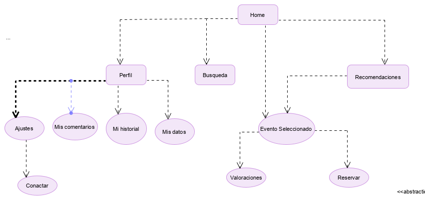

 Labelling 
----

| Etiqueta            | Nota                                                                                                           |
|---------------------|----------------------------------------------------------------------------------------------------------------|
| Evento Seleccionado | Cuando seleccionamos un evento se nos abre esta pagina que nos muestra una descripción con fotografiás del                               evento así como características que sirven para identificar al evento en las búsquedas. También podremos ver en                         algunos casos de eventos no temporales valoraciones de otros usuarios. También en los casos donde haya que                               reservar el evento nos aparece la opción de reservarlo.                                                        |
| Búsqueda            | Nos encontramos una barra de búsqueda con diferentes opciones para filtrar la búsqueda                         |
| Ajustes             | En los ajustes podremos cambiar el idioma de la aplicación. Cambien nos mostrara información de la aplicación y                         una forma de contactar con el administrador                                                                    |
| Recomendaciones     | En esta sección aparecerán eventos de la misma manera que en el inicio, solo que esta vez serán recomendaciones                         basándose en nuestro historial de búsqueda y en nuestros datos de perfil.                                      |
| Perfil              | En nuestro perfil nos aparecerá arriba un símbolo de engranaje para ir a los ajustes de la aplicación, nuestro                           historial y nuestros datos. Si el usuario aun no esta logeado se muestra un inicio de sesión.                  |
| Mi historial        | Muestra el historial del usuario de eventos pagados.                                                           |
| Mis valoraciones    | Muestra las valoraciones publicadas por el usuario.                                                            |
| Mis datos           | Muestra los datos de nuestro perfil. Desde aquí es posible modificarlos Contactar Formulario para contactar con                         un administrador Reserva Formulario de reserva de un evento                                                    |

 2.d Wireframes
-----

**Inicio**
El menú principal de nuestra aplicación donde nos aparecen tantos eventos promocionados como mejores valorados. Para seguir viendo eventos se debe desilzar a la izquierda.
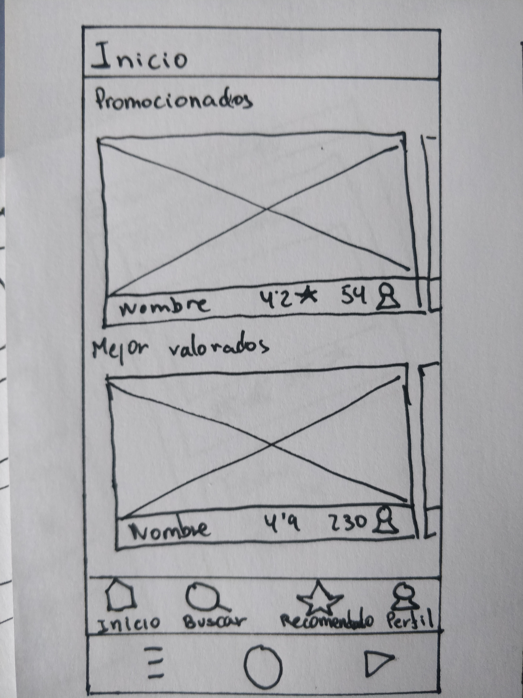  
 

**Búsqueda**  
Interfaz de búsqueda donde a partir de palabras clave o filtrado podemos buscar los eventos que queramos. Al realizar la búsqueda se mostraran miniaturas de eventos verticalmente.
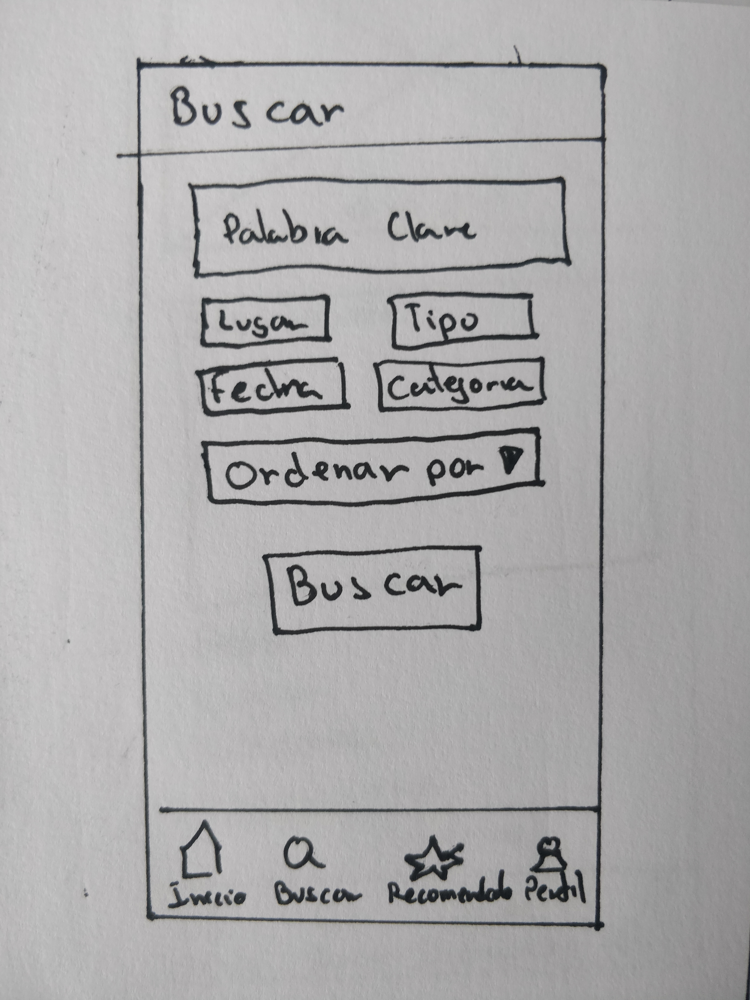  
 

**Evento**  
Cuando pinchamos en un evento aparece esta interfaz donde nos muestran fotos, descripción, valoraciones y otras características.Además en algunos casos incluye la posibilidad de reservar.
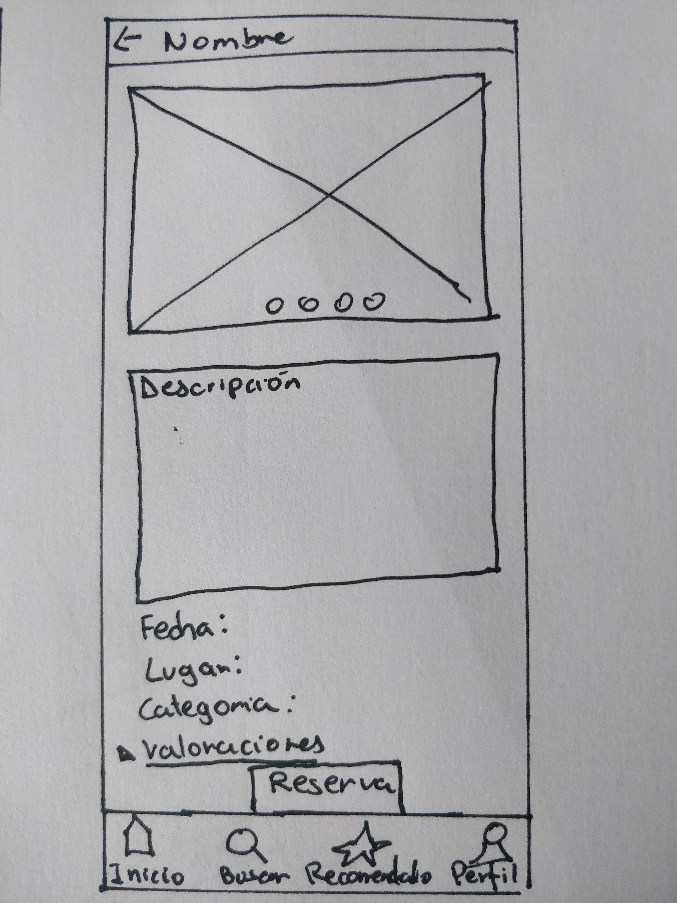  
 

**Valoraciones** 
Nos muestra las valoraciones de distintos usuarios, con un texto expandible y una calificación.
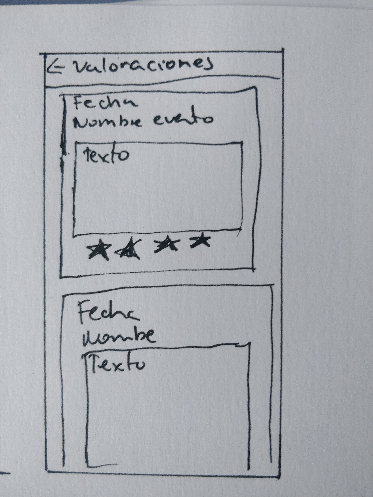  
 

**Perfil Inicio sesión**  
Al irnos a la sección de perfil si aun no estamos logeados nos aparecerá esta interfaz donde podemos logearnos con Google, Facebook o con nuestro usuario y contraseña. También esta la posibilidad de registrarse si aún no se esta registrado
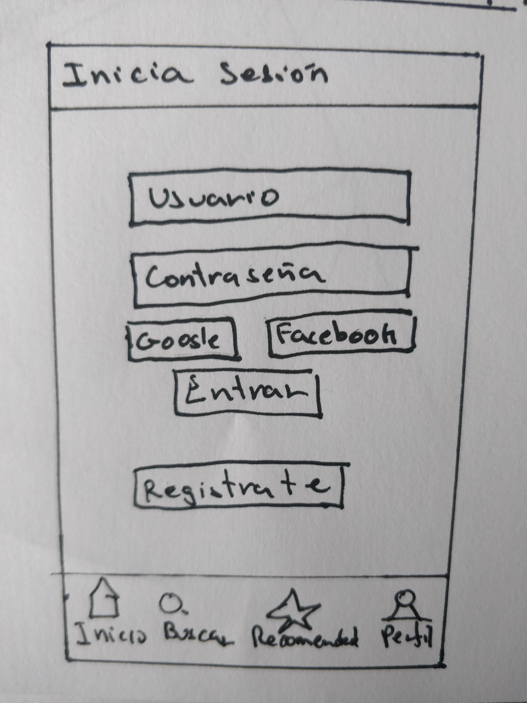  
 

**Perfil**  
Al irnos a la sección de perfil si estamos logeados aparecerá nuestro perfil con nuestros datos , valoraciones, historial y la posibilidad de modificar nuestros datos
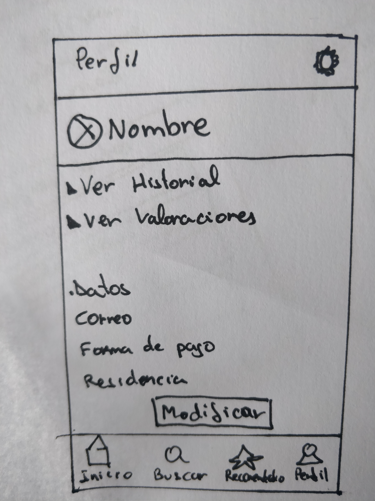  
 

**Historial**  
El historial de compras
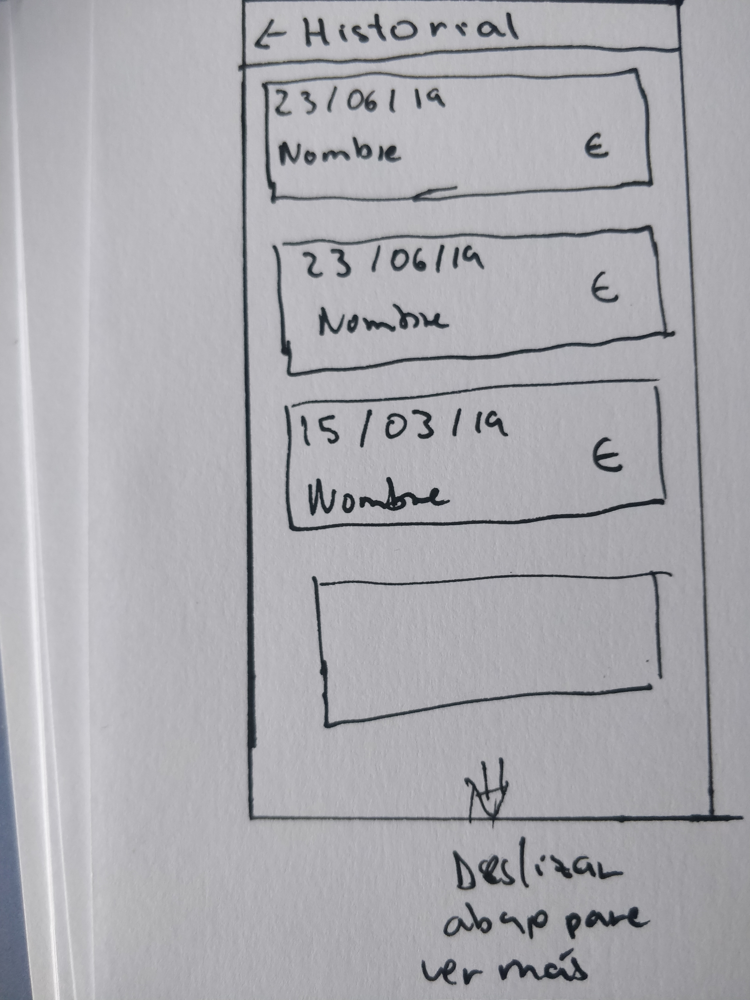  
 

**Modificar Datos**  

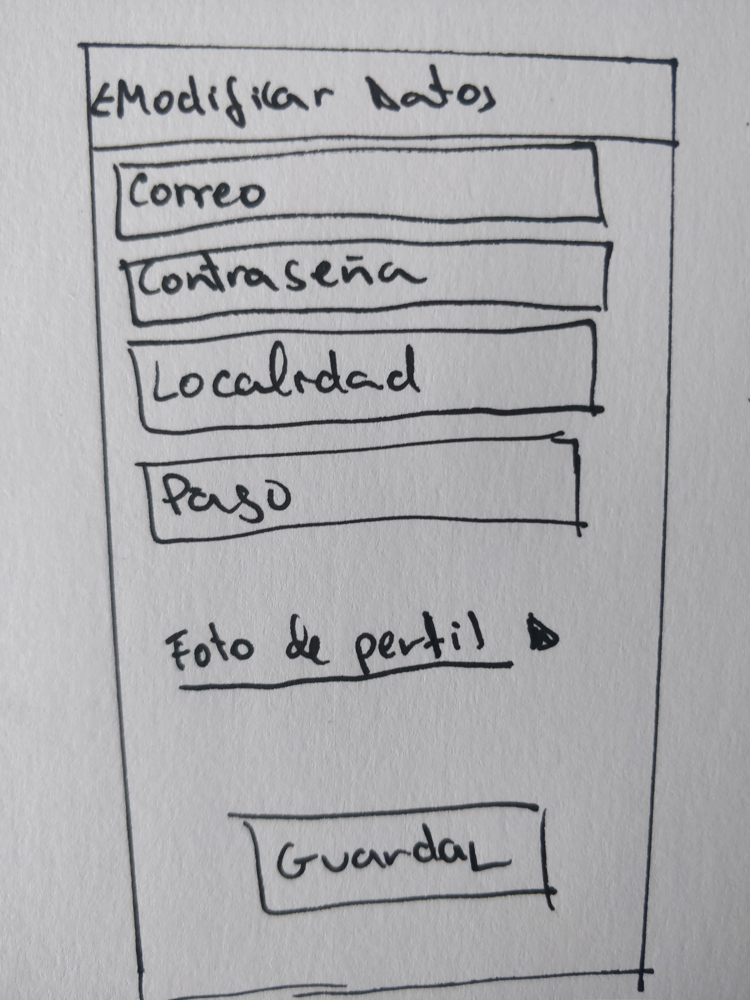  
 

**Ajustes**  
En los ajustes encontramos la posibilidad de cambiar el idioma, activar las notificaciones y contactar mediante un formulario con un administrador. Además tambien aparece un pequeño texto que describe al equipo de trabajo. En una futuro diseño es posible que se añada la opción de modo nocturno

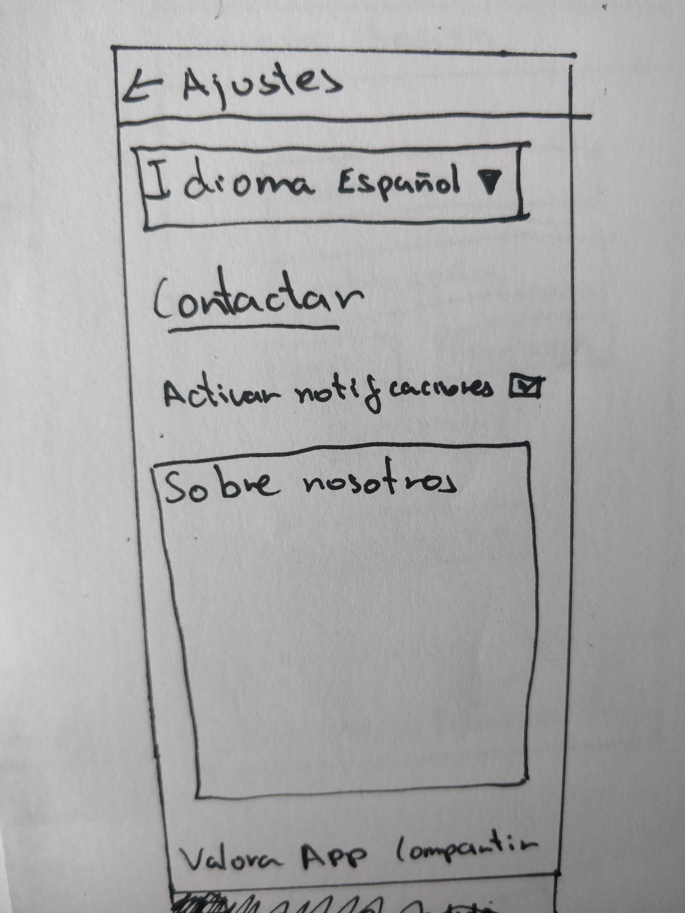  
 

**Contactar**  
Este es el formulario que hay que rellenar para contactar con un administrador. En el caso en el que el ususario no este logeado deberia incluir su correo electrónico y su nombre
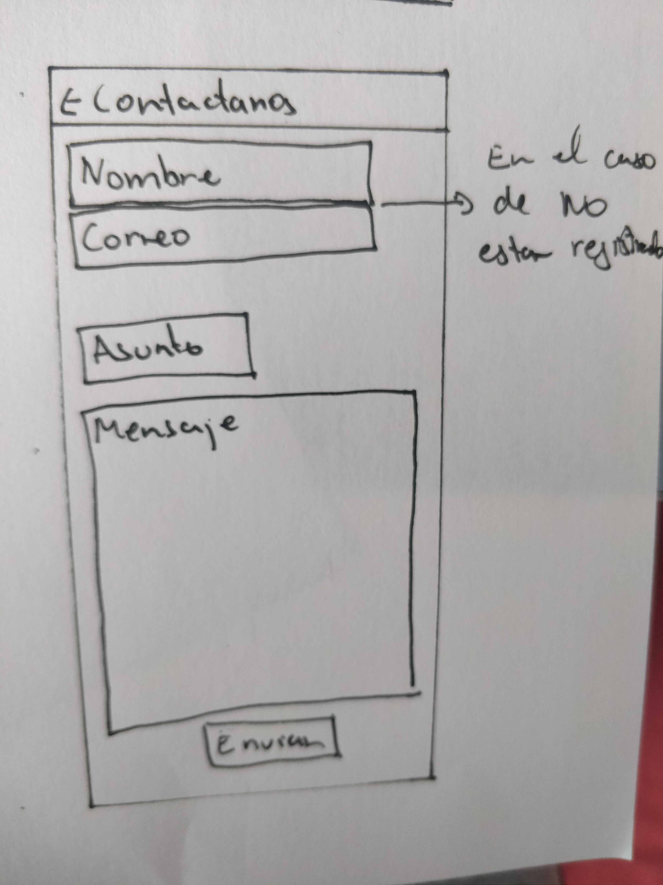  
 

**Recomendados** 
Lasección de recomendados es similar a la de Inicio pero con distintos eventos.
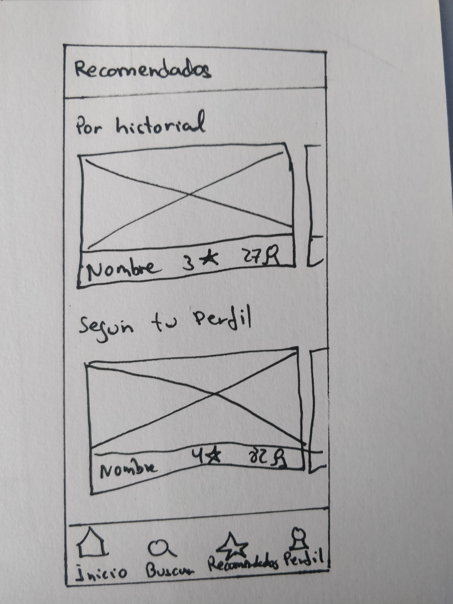  
 

